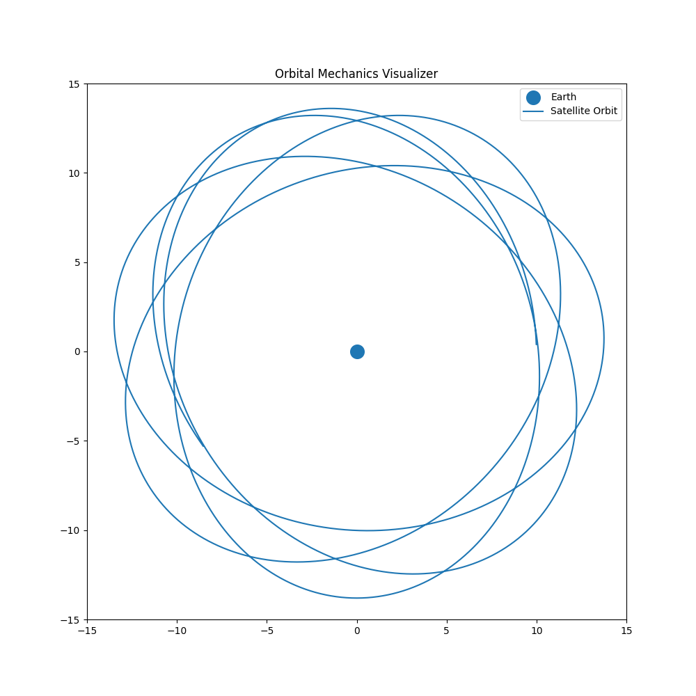

# Orbital-Mechanics-Visualizer

A Python-based simulation demonstrating satellite motion under gravitational attraction.

## Features

- Satellite orbit simulation
- Gravity-based motion
- Earth-centered orbital model
- Data visualization using Matplotlib

## Technologies

- Python
- NumPy
- Matplotlib

## Static Orbit Plot

## Animated Orbit Plot

