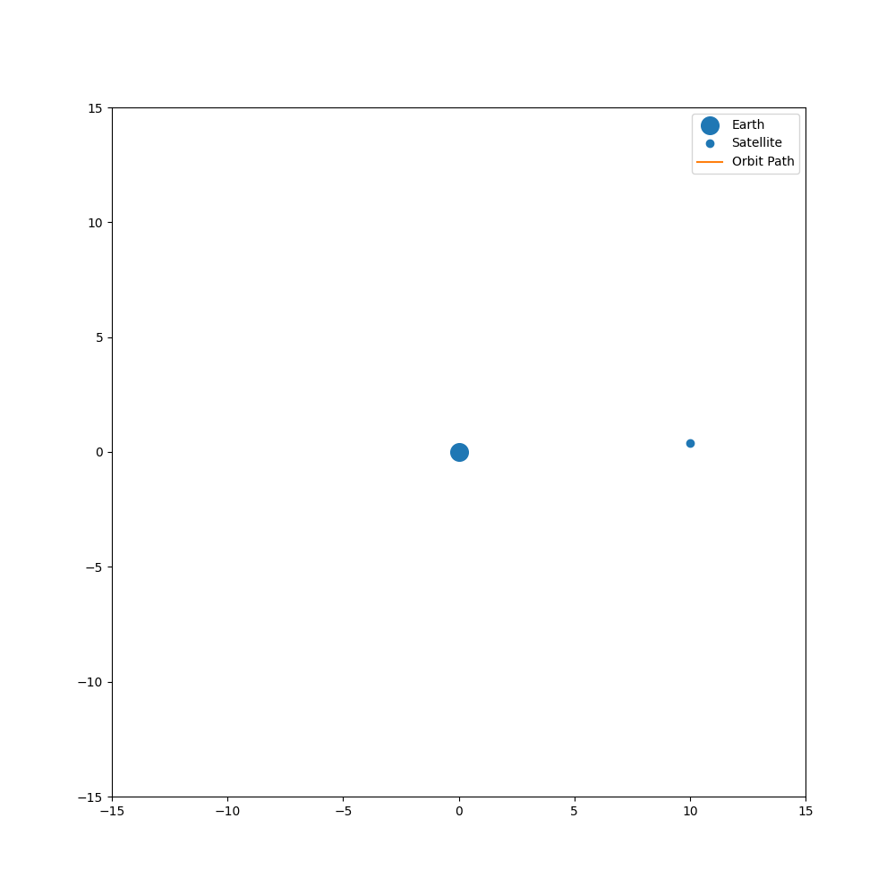

# Orbital Mechanics Visualizer

A Python-based orbital mechanics simulator that models satellite motion under gravity and visualizes orbital trajectories through both static and animated simulations. Implemented numerical physics calculations using NumPy and created interactive visualizations with Matplotlib to demonstrate core aerospace engineering concepts.

## Features

- Gravity-based orbital simulation
- Static trajectory visualization
- Real-time animated orbit visualization
- Adjustable velocity parameters
- Educational aerospace and physics application

## Technologies

- Python
- NumPy
- Matplotlib

## Static Orbit


## Animated Orbit




## Usage

### Clone the Repository

```bash
git clone https://github.com/YOUR_USERNAME/orbital-mechanics-visualizer.git
cd orbital-mechanics-visualizer
```

### Install Dependencies

```bash
pip install -r requirements.txt
```

### Run the Animated Version

```bash
python main.py
```

### Run in Google Colab

1. Open `static_orbit.ipynb` for the static simulation.
2. Open `animated_orbit.ipynb` for the animated simulation.
3. Run all cells in order.

### Outputs

- `orbit.png` — Static orbit visualization
- `orbit.gif` — Animated orbit visualization
